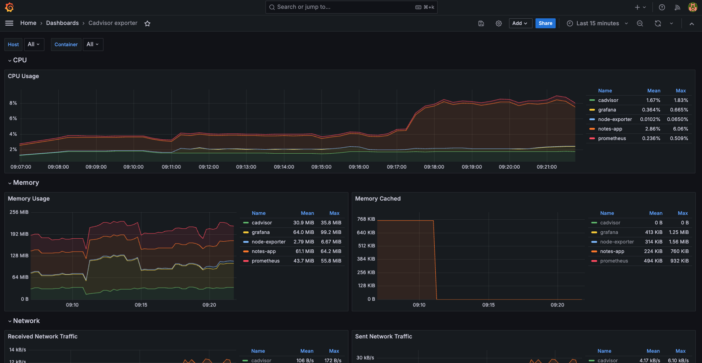
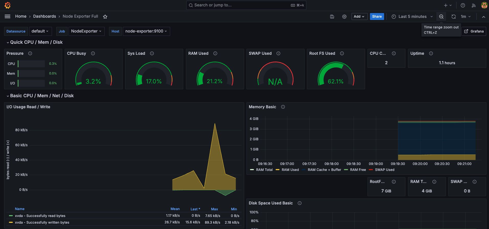

# Observability-For-DevOps

This repository provides a comprehensive observability stack tailored for DevOps engineers. It integrates key tools like Prometheus, Grafana, cAdvisor, and Node Exporter to monitor, visualize, and manage your infrastructure and applications. Additionally, it includes a custom Notes App to demonstrate the observability stack in action.




## Table of Contents
- [Overview](#overview)
- [Tech Stack](#tech-stack)
- [Features](#features)
- [Installation](#installation)
- [Usage](#usage)
- [Services](#services)
- [Volumes](#volumes)
- [Network](#network)
- [Monitoring Setup](#monitoring-setup)
- [Contributing](#contributing)
- [License](#license)

## Overview
In modern DevOps, observability is key to ensuring the health and performance of your applications and infrastructure. This repository sets up an observability stack that includes metrics collection, container monitoring, and real-time visualization.

## Tech Stack
- **Docker & Docker Compose**: Containerization and orchestration.
- **Prometheus**: Metrics collection and monitoring.
- **Grafana**: Data visualization and dashboard creation.
- **cAdvisor**: Container resource monitoring.
- **Node Exporter**: Hardware and OS metrics exporter.
- **Notes App**: A custom service to demonstrate monitoring.

## Features
- Real-time monitoring of container metrics with Prometheus.
- Visualize metrics using Grafana dashboards.
- Monitor hardware, OS metrics, and custom application performance.
- Easily extendable for additional services and metrics.
- Persistent data storage for Prometheus and Grafana.

## Installation

1. **Clone the repository**:
    ```bash
    git clone https://github.com/yourusername/Observability-For-DevOps.git
    cd Observability-For-DevOps
    ```

2. **Ensure Docker and Docker Compose are installed**:
    - [Docker Installation Guide](https://docs.docker.com/get-docker/)
    - [Docker Compose Installation Guide](https://docs.docker.com/compose/install/)

3. **Download Prometheus config file**:
    ```bash
    wget https://raw.githubusercontent.com/prometheus/prometheus/main/documentation/examples/prometheus.yml
    ```
    
4. **Run the stack**:
    ```bash
    docker compose up -d
    ```

## Usage

- Access **Grafana** at `http://localhost:3000`
  - Default credentials: `admin` / `admin` (you'll be prompted to change this)
- Access **Prometheus** at `http://localhost:9090`
- Access **cAdvisor** at `http://localhost:8080`
- **Node Exporter** metrics will be available at `http://localhost:9100/metrics`
- Access **Notes App** at `http://localhost:8000`

## Services

- **Grafana**: Visualization tool for Prometheus data.
- **Prometheus**: Collects and stores metrics.
- **Node Exporter**: Exports hardware and OS-level metrics.
- **cAdvisor**: Provides container resource usage and performance metrics.
- **Notes App**: Sample application to demonstrate monitoring.

## Volumes

- `prometheus_data`: Stores Prometheus data persistently.
- `grafana_data`: Stores Grafana dashboards and data persistently.

## Network

- **monitoring**: Custom bridge network to ensure isolation and communication between services.

## Monitoring Setup

- **Grafana Dashboards**: Pre-configured to visualize data from Prometheus.
- **Prometheus Configuration**: Configured to scrape metrics from Node Exporter, cAdvisor, and Notes App.

## Contributing

Contributions are welcome! Please submit a pull request or open an issue for any changes or improvements.

## License

This project is licensed under the MIT License - see the [LICENSE](LICENSE) file for details.
